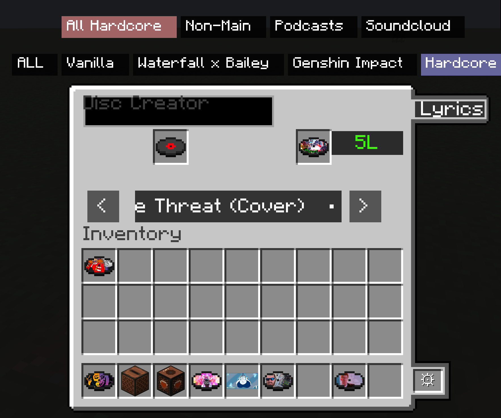
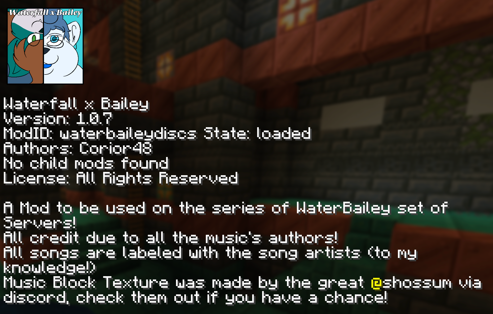
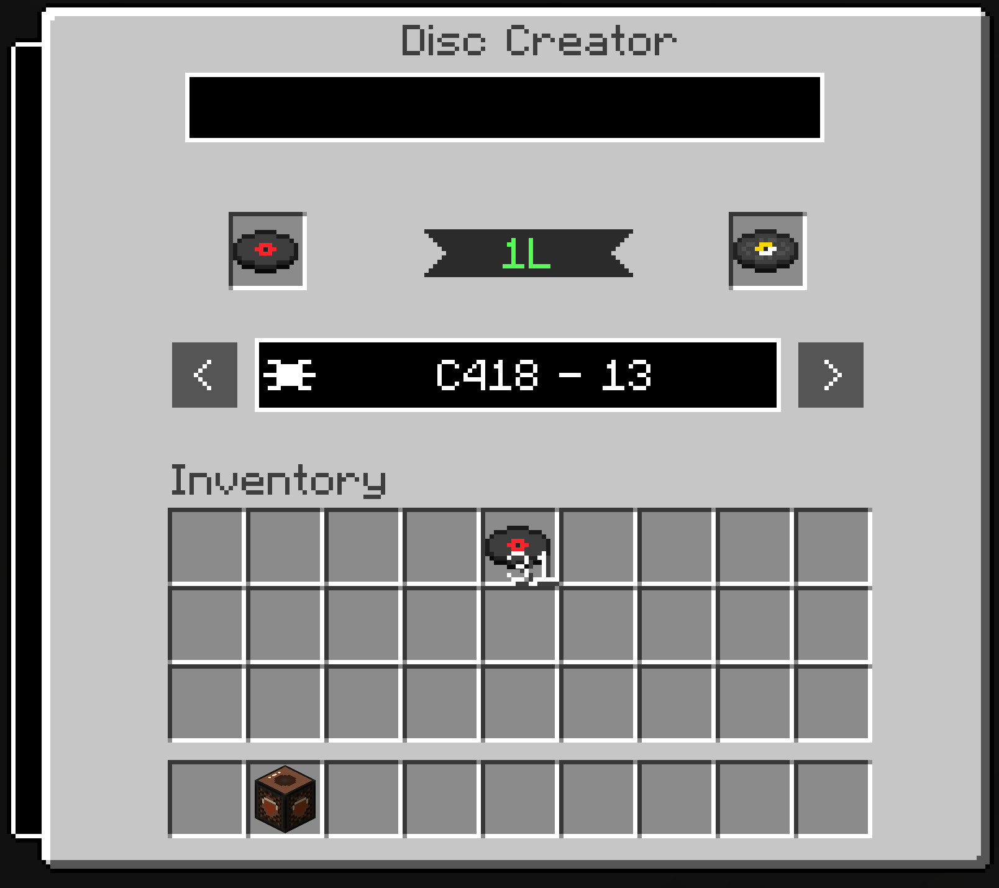
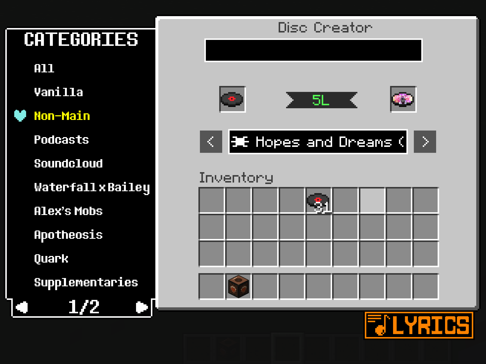

<h1></h1>

  
Well howdy there! Name's CrystalizedBean28/Corior48, and welcome to the repository for my lastest iterations of my 2 music disc mods!

This repository will hold (in branches) the files for the <b><i>BigBurrAddons Mod</i></b> and <b><i>Cor's Hardcore Additions Mod</i></b>!

Now, this is the second time that I started to redo this file, BUT some idiot (me) never pasted what I had originally before coping a folder over without the clipboard history being on.... i love myself :D

  
Right.... let's get into what this repository has to offer!

  

<h1></h1>
<h1 align=center></h1>
  
So, this repository will offer two different mods! Let us go over them!

  
Quick Note: Each mod name's first mention in this specific section contains links to their respective branch! Feel free to check them out!

  

  
The <a href="https://github.com/Corior48/CorDiscMods/tree/BigBurrAddons">BigBurrAddons Mod</a> was initally mocked up for a seasonal set of servers I had ran that allowed memebers of both <b>BigBurrBailey's</b> and <b>Waterfall Gaming's</b> respective discord servers!

  
The intial desire to allow members to have their own custom music ingame was first sparked around midway into Season 1's runtime... I think! However, it wouldn't get a proper introduction in the realms of a custom mod till Season 2 was initally in development... which was around the tail end of Season 1's runtime!

  
Throughout Seasons 2.0 and 2.1 of (what was known as) Waterfall x Bailey, the mod had upgraded from a simple Villager Profession for disc mod to a full on Disc Creation Mod! v10.6 had a huge bug in it however, as when the Disc Creator's Menu were to be opened in a server, it would just crash the entire server....

  
v1.0.7 was set to fix this, but ultimately was never finished because i was just too fed up trying to fix it.... till i decided to revamped everything that has become the 1.21.1 Hardcore Disc Mod

  
 

  
This was the inital look that had defined this era of the mod during v1.0.6/v1.0.7.... yeah it's way to crowded in my opinion

  
So, by the time I had rebranded the entire mod from Waterfall x Bailey to BigBurrAddons, I had a fully polished iteration of what I wanted to see in a rework... just in the form of the new Hardcore Disc Mod haha!

  
I plan to get a new server up and running for the newest iteration of the BigBurrSMP, but just haven't made it that far just yet considering I've perfecting my Hardcore instance's mod...

So, <a href="https://github.com/Corior48/CorDiscMods/tree/Hardcore_Disc">Cor's Hardcore Additions Mods</a> is the downport and rework of my original 1.21.10 Hardcore Challenge Mod! The inital 1.21.10 mod was based off an early version of the WaterBailey-Discs Mod, just with a different catalog of discs! Otherwise, it was pretty much the same as the early versions of the WaterBailey Mod

Due to the 1.21.10 iteration being so out-of-date compared to v1.0.6 of the WaterBailey Mod (and with that crashing server) i opted to rework and rewrite each mod from scratch! Talking merging the original disc list from 1.21.10, combined with all the features of WaterBailey v1.0.6, and made to NOT crash servers when the block menu is opened!

I decided to work out the Hardcore Mod first since I could always get the logic side crossed over between mods, but it did let me adjust the look and feel visually to match what I had in mind for this iteration!

The Disc Creator Menu uses roughly the same texture as the WaterBailey v1.0.6's Menu, but expanded to feel less cluttered! But with the added features of an expandable categories tab to the left, and the lyrics button now poping from the bottom of the screen!

 

These 2 screenshots are of what v1.0.1 (Released 19 June 2026) has to offer!

This mod was made to be used in a custom modpack that my friend Evil has made for me! Fortunately, I was able to have it see the other mods that is featured in the modpack that offers discs! These discs are stored in different categories, of which there is so many of them, that I had to make the tab contain multiple pages!

The Category Tab and Lyrics Button are both inspired by Undertale's style! I was a bit obsessed back in the day lmao

<h1></h1>
<h1 align=center></h1>

With all of this in mind... if you have read this far down, I'm actually kinda surprised your didn't leave midway through! But nevertheless, I'm grateful you read this far!

Considering I have multiple Disc Mod repositories that uses the same basic setup, I wanted to start fresh with a new repository while also making it the ONLY repository for this rewrite!

Thank you for reading, enjoy browsing through this code monster!

